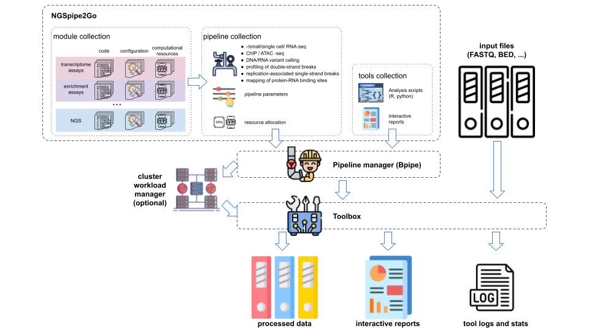

# NGSpipe2go #

A set of NGS data analysis tools and pipelines developed and utilised at the Institute of Molecular Biology gGmbH in Mainz (https://www.imb.de/).

## Prerequisites ##
### RNA-seq pipeline ###
#### Programs required ####
- FastQC
- STAR
- Samtools
- Bedtools
- Subread
- Picard
- UCSC utilities
- RSeQC
- DEseq2
- dupRadar (provided by another project from imbforge)

#### Files required ####
- targets.txt (sample names)
- contrasts.txt (pairwise comparisons)
- raw reads (.fastq.gz) or mapped data (.bam)

### ChIP-seq pipeline ###
#### Programs required ####
- FastQC
- Bowtie
- Samtools
- Bedtools
- Picard
- UCSC utilities
- MACS2
- ChIPSeeker
- encodeChIPqc (provided by another project from imbforge)

#### Files required ####
- targets.txt (sample names)
- raw reads (.fastq.gz) or mapped data (.bam)

### DNA-seq pipeline ###
#### Programs required ####
- FastQC
- BWA
- Samtools
- Bedtools
- Picard
- dupRadar (provided by another project from imbforge)
- GATK

#### Files required ####
- raw reads (.fastq.gz) or mapped data (.bam)

GATK requires chromosomes in bam files to be karyotypically ordered. Best you use an ordered genome fasta file as reference for the pipeline (assigned in *essential.vars.groovy*, see below).

## NGSpipe2go preparations ##

### Put NGSpipe2go into the project dir ###
NGS projects should be run in a consistant and reproducible way, hence NGSpipe2go asks you to copy all tools into the project folder, which will ensure that you always use the same program versions at a later time point. This can be done either from a local NGSpipe2go copy, a version from the GitHub releases (https://github.com/imbforge/NGSpipe2go/releases) or using the most recent development version from the GitHub repository

    git clone https://github.com/imbforge/NGSpipe2go.git <project_dir>/NGSpipe2go

### Choose one of the pipelines ###

Select a pipeline to run and make symlinks in the main project dir, e.g. for RNA-seq project

    ln -s NGSpipe2go/pipelines/RNAseq/* .
    ln -s NGSpipe2go/modules/RNAseq/essential.vars.groovy .
    ln -s NGSpipe2go/modules/RNAseq/tool.locations.groovy .

or for single-read (SR) ChIP-seq project

    ln -s NGSpipe2go/pipelines/ChIPseq/* .
    ln -s NGSpipe2go/modules/ChIPseq/essential.vars.groovy .
    ln -s NGSpipe2go/modules/ChIPseq/tool.locations.groovy .
    
or for paired-end (PE) ChIP-seq project

    ln -s NGSpipe2go/pipelines/ChIPseq_pe/* .
    ln -s NGSpipe2go/modules/ChIPseq/essential.vars.groovy .
    ln -s NGSpipe2go/modules/ChIPseq/tool.locations.groovy .

### Customise NGSpipe2go to your needs ###

Adjust the project-specific information in the following files:

- *essential.vars.groovy* specifies the main project variables like project dir and reference genome
- *xxx.pipeline.groovy* describes the pipeline steps and the location of the respective modules
- *targets.txt* and *contrasts.txt* contain the sample names and the differential group comparisons
- *tool.location.groovy* and *bpipe.config* specify the paths and resource allocation for the tools

Additional software parameters can be customised in the *xxx.vars.groovy* files accompanying each bpipe module.

## Run a pipeline ##

Copy the input FastQ files into the <project_dir>/rawdata folder.

Using GNU Screen (for persistence) load the bpipe module customised for the Slurm job manager, e.g.

    screen
    module load bpipe/0.9.9.3.slurm

Start running the pipeline of choice, e.g.

    bpipe run rnaseq.pipeline.groovy rawdata/*.fastq.gz

or

    bpipe run chipseq.pipeline.groovy rawdata/*.fastq.gz    

or

    bpipe run chipseq_pe.pipeline.groovy rawdata/*.fastq.gz

## Compile a project report ##

The final result of the provided pipelines will be saved in the ./reports folder.
The Rmd file can be edited or customised using a text editor and then converted into HTML report using knitr
    
    R usage:
    rmarkdown::render("DEreport.Rmd")
    or
    rmarkdown::render("ChIPreport.Rmd")
